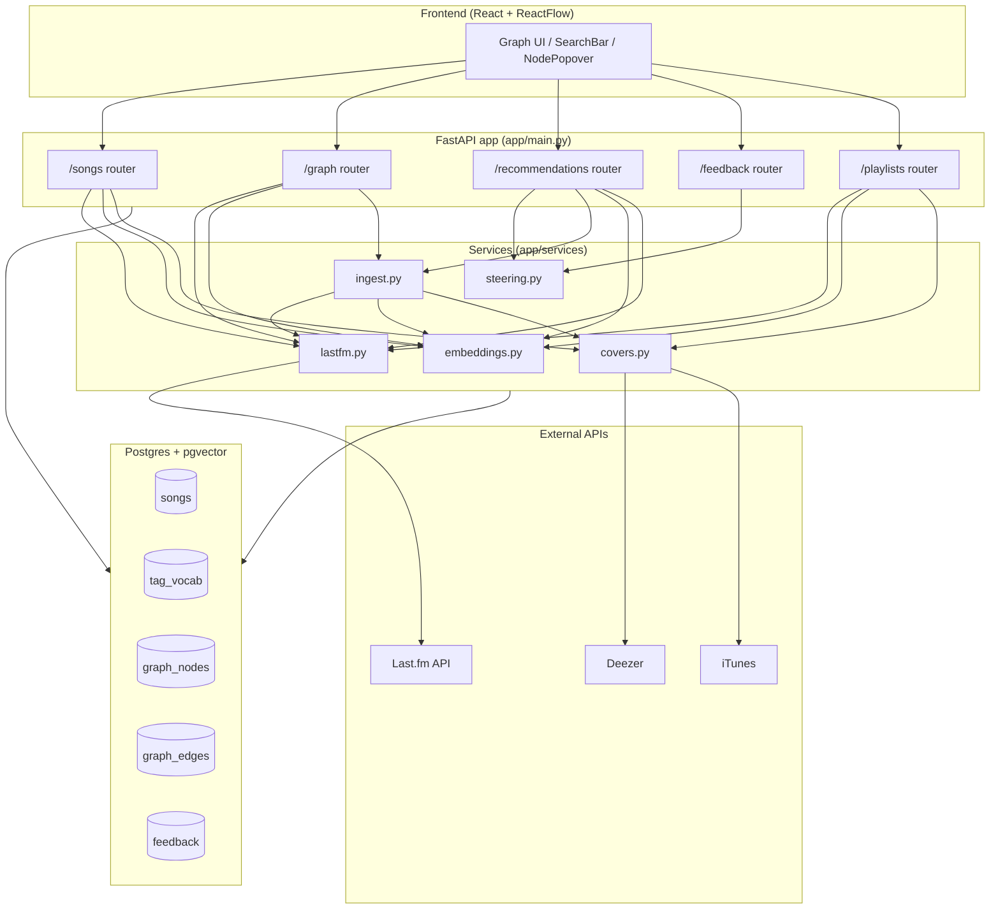
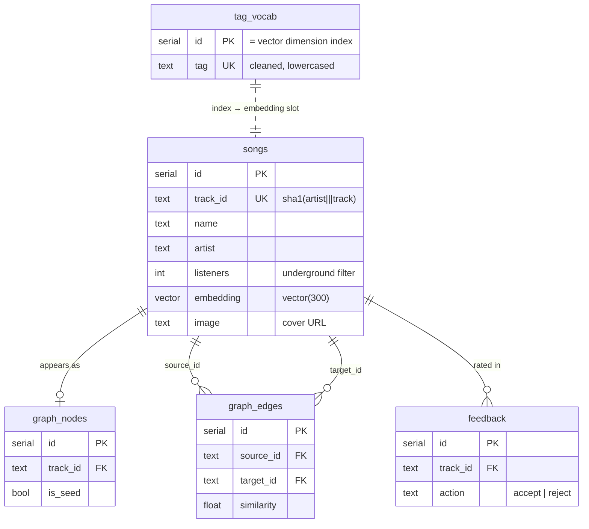
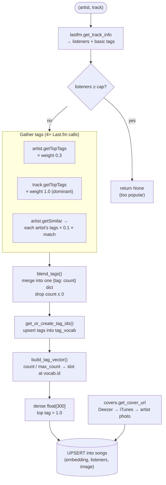
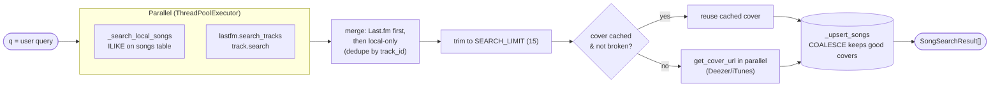
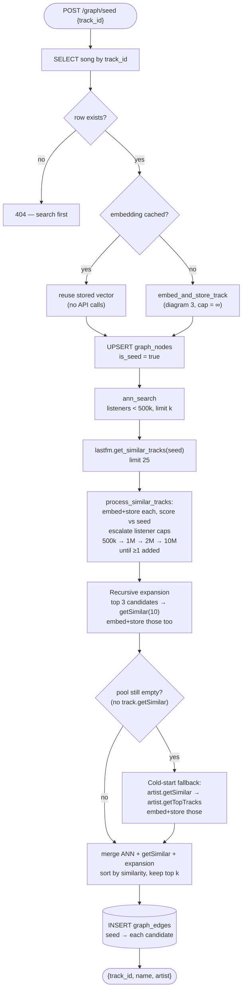
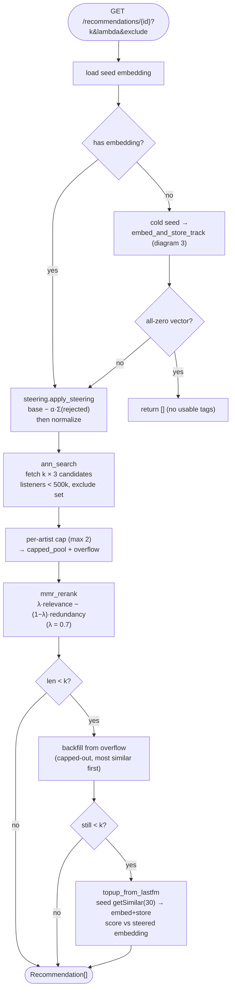
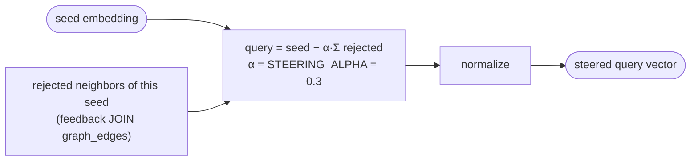
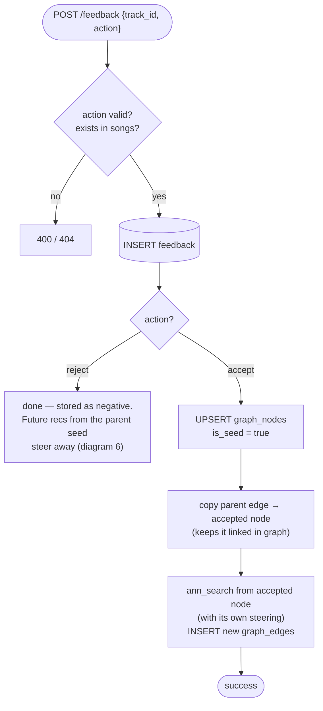
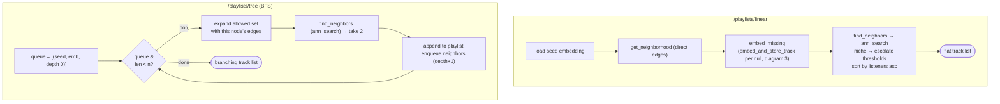
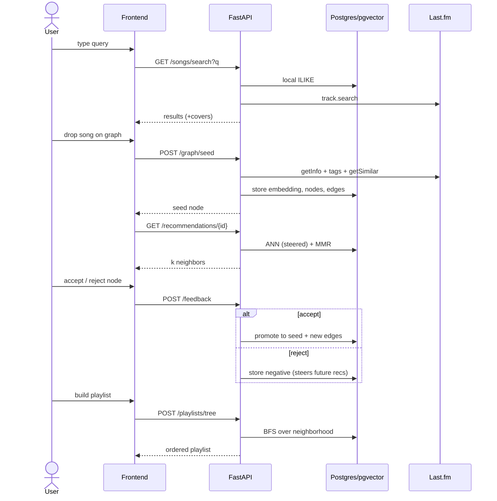

# Backend Architecture — Mermaid Diagrams

Visual reference for how the Underground Music Discovery backend actually works
(grounded in the code under `app/`, not just the original plan).

> **Heads up — the code has drifted from `CLAUDE.md`:**
> - **Spotify is not used.** Song search merges the local DB + Last.fm `track.search`.
> - **IDs are `track_id`**, a 20-char SHA1 of `"{artist}|||{track}"` (see `embeddings.make_track_id`), not `spotify_id`.
> - **Album covers** come from Deezer → iTunes → Deezer artist photo (`services/covers.py`).
> - Extra machinery exists beyond the plan: **blended tags**, **MMR re-ranking**, **reject steering**, **linear & tree playlists**, and **recursive seed expansion**.

## Two shared building blocks

Most of the flows below are built from the same two helpers, so several diagrams
reference them instead of redrawing the steps:

- **`ingest.embed_and_store_track(artist, name, listener_cap)`** — the *one*
  tag→vector embedding pipeline (diagram 3). Cache-aware: returns the stored row
  if already embedded, otherwise runs the Last.fm calls + `blend_tags` + vector
  build and upserts. Used by seeding, `/songs/.../features`, recommendation
  top-up, and playlist backfill.
- **`embeddings.ann_search(embedding, *, listeners_cap, exclude_ids, allowed_ids, limit, cursor)`**
  — the *one* pgvector nearest-neighbor query. Used by seeding, recommendations,
  feedback (accept rerun), and both playlist strategies.

---

## 1. System overview

---

## 2. Database schema (ER)

---

## 3. Embedding pipeline (tags → vector) — `ingest.embed_and_store_track`

How any `(artist, track)` becomes a stored `vector(300)`. This *is*
`ingest.embed_and_store_track` — the single shared block every other flow calls
when it needs an embedding (`services/ingest.py`, `services/embeddings.py`,
`lastfm.blend_tags`). A cache hit short-circuits before any Last.fm call.

---

## 4. Song search (`GET /songs/search`)

---

## 5. Seeding the graph (`POST /graph/seed`)

The core loop. Builds the seed embedding (cache-aware), runs ANN search,
bootstraps from Last.fm `getSimilar`, and recursively expands so the
neighborhood is dense enough for playlists.

---

## 6. Recommendations (`GET /recommendations/{track_id}`)

ANN + reject-steering + per-artist cap + MMR diversity, with two fallbacks to
honor the requested `k`.

### Reject steering (`services/steering.py`)

---

## 7. Feedback loop (`POST /feedback`)

---

## 8. Playlist generation (`POST /playlists/*`)

Two strategies over the seed's graph neighborhood. `niche` mode walks listener
thresholds (100 → 1k → 10k → 100k → 500k) to favor the most underground tracks.

---

## 9. End-to-end discovery journey

